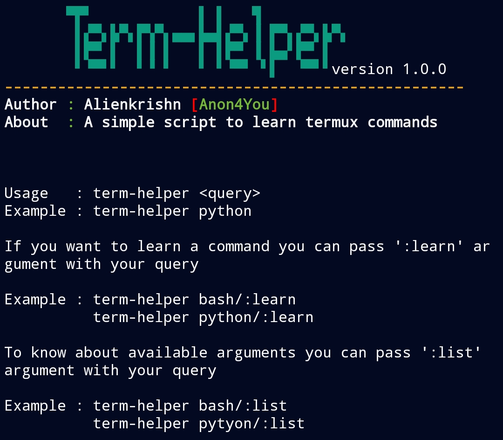

# term-helper
Is a command line helper tool and Cheatsheet learn any command on terminal 🧑‍💻😗
## Screenshot


## Installation

```
git clone https://github.com/Anon4You/term-helper
cd term-helper
bash term-helper.sh
```
## With Alienkrishn Repo
```
apt install termu-helper
```
